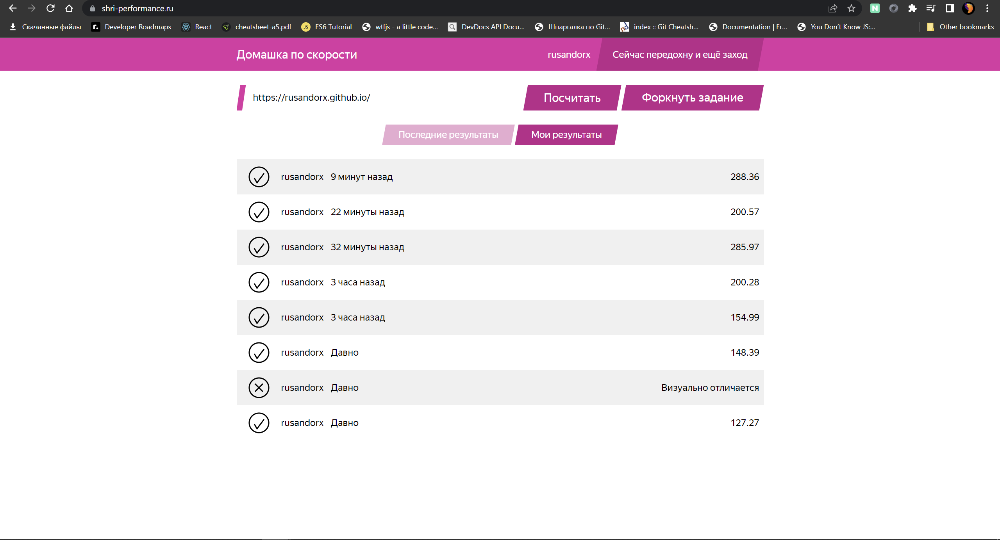
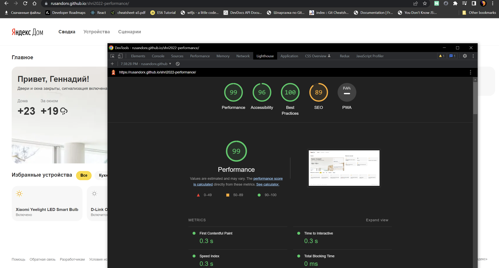

# Что я сделал:

- Изменил формат картинки с png до webp.
- Минифицировал все.
- Добавил скрипту defer, чтобы он не блокировал страницу.
- Убрал bootstrap и react со страницы, так как они не используются.

Страница проходит с 288 баллами:

Если что, то можно зайти и проверить самому.

Lighthouse:

